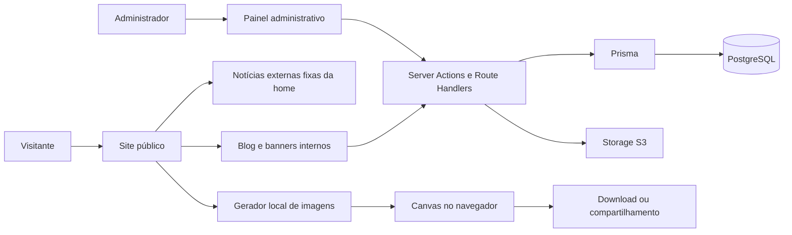

# Arquitetura

## Decisão principal

O projeto usa Next.js com App Router como aplicação React full-stack. Essa abordagem reúne páginas indexáveis, componentes interativos, APIs internas, autenticação e Prisma em uma única base de código, reduzindo a complexidade operacional do MVP.

## Visão dos módulos



## Camadas

### Apresentação

Rotas, layouts e componentes React. Componentes de servidor são o padrão; componentes de cliente são usados apenas para interação, estado local ou APIs do navegador.

### Aplicação

Casos de uso como publicar notícia, programar banner, salvar mídia e selecionar molduras. Regras críticas ficam em funções independentes da interface.

### Dados

Repositórios ou serviços baseados em Prisma. Componentes não devem espalhar consultas complexas; cada consulta deve expor uma intenção clara.

### Infraestrutura

PostgreSQL, storage de objetos, autenticação, logs e plataforma de deploy.

## Estrutura de diretórios proposta

```text
src/
├── app/
│   ├── (public)/
│   │   ├── page.tsx
│   │   ├── noticias/
│   │   └── faca-sua-foto/
│   ├── admin/
│   ├── api/
│   ├── layout.tsx
│   └── globals.css
├── components/
│   ├── ui/
│   ├── site/
│   ├── admin/
│   └── photo-studio/
├── features/
│   ├── posts/
│   ├── banners/
│   ├── media/
│   └── image-templates/
├── lib/
│   ├── auth/
│   ├── db/
│   ├── storage/
│   ├── validation/
│   └── utils/
├── styles/
└── types/
prisma/
├── schema.prisma
├── migrations/
└── seed.ts
public/
└── assets/
```

## Rotas públicas

| Rota | Responsabilidade |
| --- | --- |
| `/` | Landing page completa |
| `/noticias` | Listagem paginada de posts publicados |
| `/noticias/[slug]` | Conteúdo individual da notícia |
| `/faca-sua-foto` | Editor e exportação das peças |
| `/privacidade` | Política de privacidade e tratamento de imagens |

## Rotas administrativas

| Rota | Responsabilidade |
| --- | --- |
| `/admin/login` | Autenticação |
| `/admin` | Dashboard |
| `/admin/noticias` | Listagem e filtros |
| `/admin/noticias/nova` | Criação |
| `/admin/noticias/[id]` | Edição e prévia |
| `/admin/banners` | Gerenciamento de banners |
| `/admin/midias` | Biblioteca de arquivos |
| `/admin/molduras` | Temas do gerador |

## Renderização e cache

- A landing page renderiza as duas matérias externas a partir de um contrato TypeScript versionado, sem consulta à API de notícias.
- As páginas internas de notícias e o admin continuam usando o fluxo dinâmico existente.
- Conteúdo público pode usar cache com revalidação por tag.
- Publicar ou alterar conteúdo invalida as tags relacionadas.
- Admin é dinâmico, autenticado e não deve ser indexado.
- O estúdio de fotos é um componente de cliente carregado somente na rota necessária.

## Limites entre módulos

- `posts` não conhece detalhes visuais dos cards.
- `media` controla upload, metadados e exclusão segura.
- `banners` decide elegibilidade por status e período.
- `photo-studio` recebe definições de moldura, mas processa a foto localmente.
- Autorização é validada no servidor, mesmo quando a interface oculta uma ação.

## Tratamento de erros

- Erros esperados retornam mensagens acionáveis em português.
- Falhas internas recebem um identificador de correlação e mensagem genérica para o usuário.
- Uploads inválidos são rejeitados antes de qualquer persistência.
- Uma moldura indisponível não impede o uso das demais.
- Páginas inexistentes usam uma tela 404 consistente com o site.
