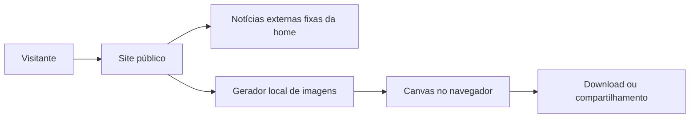

# Arquitetura

## Decisão principal

O projeto usa Next.js com App Router como aplicação React full-stack. A aplicação atual prioriza páginas públicas indexáveis e o gerador local de fotos; não há painel administrativo nem API de publicação.

## Visão dos módulos

## Camadas

### Apresentação

Rotas, layouts e componentes React. Componentes de servidor são o padrão; componentes de cliente são usados apenas para interação, estado local ou APIs do navegador.

### Conteúdo

A home renderiza a curadoria aprovada de `src/data/external-news.ts`. Os caminhos `/redes-sociais`, `/jingle` e `/noticias` são aliases de navegação que reescrevem para a home e fazem rolagem até a seção, sem criar páginas duplicadas.

### Infraestrutura

Deploy web, CDN, logs e ativos estáticos versionados. O processamento da foto de apoiador ocorre somente no navegador.

## Rotas públicas

| Rota | Responsabilidade |
| --- | --- |
| `/` | Landing page completa, incluindo a seção de notícias |
| `/faca-sua-foto` | Editor e exportação das peças |
| `/historia` | Biografia e trajetória pública |

Os aliases `/redes-sociais`, `/jingle` e `/noticias` preservam a landing page e não são páginas independentes.
| `/politica-de-privacidade` | Política de privacidade e tratamento de imagens |

Não há rotas administrativas. URLs legadas de notícias individuais sem conteúdo retornam 404 e não entram no sitemap.

## Renderização e cache

- A landing page renderiza as duas matérias externas a partir de um contrato TypeScript versionado.
- Conteúdo público pode ser gerado estaticamente; o sitemap não depende de escrita em disco ou de sessão.
- O estúdio de fotos é um componente de cliente carregado somente na rota necessária.

## Limites entre módulos

- `external-news` controla dados editoriais da curadoria; os componentes decidem apenas a apresentação.
- `photo-studio` recebe definições de moldura, mas processa a foto localmente.
- Não há autorização de servidor ou mutações administrativas no produto atual.

## Tratamento de erros

- Erros esperados retornam mensagens acionáveis em português.
- Uma moldura indisponível não impede o uso das demais.
- Páginas inexistentes usam uma tela 404 consistente com o site.
