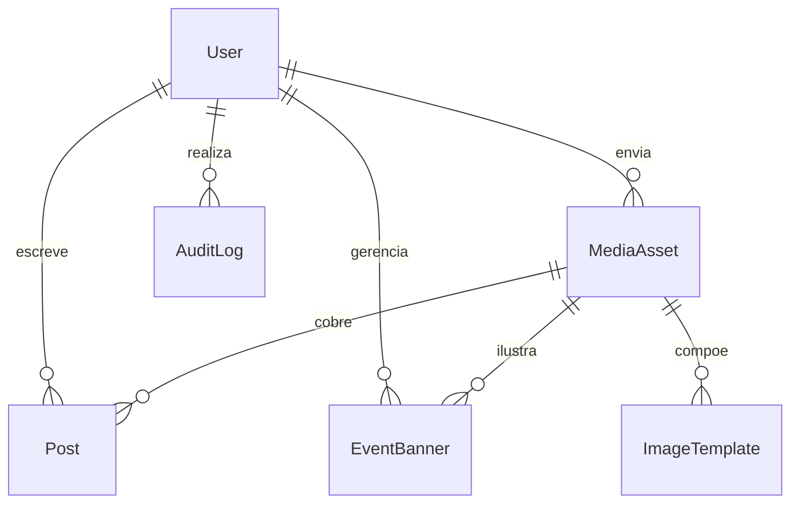

# Banco de dados

## Banco oficial

PostgreSQL é o banco de produção. Prisma controla schema, migrations e cliente tipado. SQLite pode ser usado apenas em testes isolados quando não esconder diferenças relevantes do PostgreSQL.

## Modelos conceituais

### User

Administrador autenticado.

- `id`: UUID.
- `name`: nome de exibição.
- `email`: único e normalizado.
- `passwordHash`: opcional conforme provedor de autenticação.
- `role`: `ADMIN` ou `EDITOR`.
- `active`: permite revogar acesso.
- `createdAt`, `updatedAt`, `lastLoginAt`.

### Post

Notícia institucional.

- `id`: UUID.
- `title`, `slug`, `excerpt`.
- `content`: conteúdo estruturado ou HTML sanitizado.
- `status`: `DRAFT`, `SCHEDULED`, `PUBLISHED`, `ARCHIVED`.
- `category`: categoria editorial.
- `coverImageId`: mídia principal.
- `featured`: permite destaque editorial.
- `publishedAt`, `scheduledAt`.
- `authorId`, `createdAt`, `updatedAt`.
- `seoTitle`, `seoDescription`.

### EventBanner

Chamada temporária para reunião, evento ou mobilização.

- `id`, `title`, `description`.
- `imageId` e `mobileImageId` opcionais.
- `ctaLabel`, `ctaUrl`.
- `startsAt`, `endsAt`.
- `status`: `DRAFT`, `ACTIVE`, `INACTIVE`.
- `priority` para desempate.
- `createdById`, `createdAt`, `updatedAt`.

### MediaAsset

Arquivo público gerenciado pela equipe.

- `id`, `key`, `url`.
- `mimeType`, `size`, `width`, `height`.
- `altText`, `originalName`.
- `createdById`, `createdAt`.

### ImageTemplate

Moldura usada no gerador.

- `id`, `name`, `slug`.
- `format`: `AVATAR`, `POST`, `STORY`.
- `overlayImageId`.
- `width`, `height`.
- `safeArea`: configuração JSON validada.
- `active`, `sortOrder`.
- `createdAt`, `updatedAt`.

### SiteSetting

Configurações públicas simples que não justificam nova tabela.

- `key`: chave única.
- `value`: JSON validado conforme a chave.
- `updatedById`, `updatedAt`.

### AuditLog

Rastro de ações administrativas relevantes.

- `id`, `userId`.
- `action`, `entityType`, `entityId`.
- `metadata`: JSON sem dados sensíveis.
- `createdAt`.

## Relações principais

## Regras de dados

- IDs usam UUID ou CUID de forma consistente.
- Datas são armazenadas em UTC e exibidas no fuso configurado.
- Slugs são únicos e derivados do título apenas na criação; edição posterior não muda o slug automaticamente.
- Exclusão de conteúdo editorial é lógica sempre que houver valor de auditoria.
- Uma mídia referenciada não pode ser apagada sem remoção ou substituição das referências.
- Publicação exige título, resumo, conteúdo, capa com texto alternativo e data válida.
- Somente um banner elegível de maior prioridade aparece em cada posição definida.

## Índices

- `Post(status, publishedAt)` para listagens públicas.
- `Post(slug)` único.
- `EventBanner(status, startsAt, endsAt, priority)` para seleção ativa.
- `ImageTemplate(format, active, sortOrder)` para o gerador.
- `AuditLog(entityType, entityId, createdAt)` para investigação.

## Migrations e seed

- Toda mudança do schema deve gerar migration nomeada de forma descritiva.
- Migrations aplicadas não são editadas; correções recebem nova migration.
- O seed cria apenas conteúdo demonstrativo e um usuário administrativo a partir de variáveis seguras.
- Dados reais, senhas e tokens nunca entram no seed versionado.
