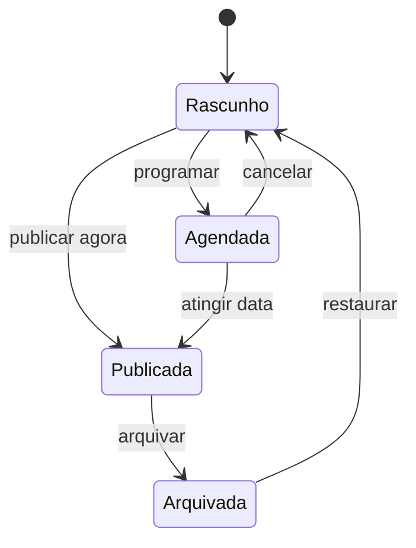

# Blog, banners e administração

## Perfis de acesso

| Perfil | Permissões |
| --- | --- |
| `ADMIN` | Usuários, notícias, banners, mídias, molduras e configurações |
| `EDITOR` | Notícias, banners e mídias; sem gerenciar usuários ou configurações críticas |

Toda autorização é validada no servidor. Ocultar um botão na interface não substitui a verificação da função do usuário.

## Notícias exibidas na landing page

A seção **Notícias** da home é uma curadoria fixa de duas matérias externas aprovadas pela equipe de comunicação. Ela é renderizada a partir de `src/data/external-news.ts`, não consulta `/api/noticias` e não depende do painel administrativo. Cada card informa veículo, data, título, resumo e link seguro para a matéria original.

Esse comportamento é específico da home. O CRUD abaixo continua documentando o fluxo administrativo de notícias para as páginas internas existentes.

## Fluxo de notícia

## Campos editoriais

- Título.
- Slug editável antes da primeira publicação.
- Resumo curto.
- Categoria.
- Imagem de capa e texto alternativo.
- Conteúdo rico limitado a blocos permitidos.
- Data de publicação imediata ou programada.
- Opção de destaque.
- Título e descrição para mecanismos de busca.

## Regras de publicação

- Rascunhos e prévias não aparecem em buscas públicas.
- Uma notícia agendada só é pública quando a data for alcançada.
- A landing page principal mostra os dois cards externos fixos definidos no contrato editorial. A listagem e as páginas internas continuam usando o fluxo dinâmico administrado abaixo.
- A listagem completa usa paginação estável e ordenação decrescente por publicação.
- Alterações em notícia publicada invalidam cache da página, listagem e landing page.
- Arquivar remove a notícia das listagens sem destruir seu histórico.

## Pré-visualização

O admin deve oferecer prévia autenticada com o mesmo renderer da página pública. A prévia usa URL temporária ou sessão autorizada, recebe `noindex` e nunca revela outros rascunhos.

## Banners

O banner divulga reunião, evento, adesivaço ou comunicado. Cada registro pode ter:

- Título e descrição curta.
- Imagem desktop e imagem mobile opcionais.
- Texto e destino do botão.
- Período de exibição.
- Prioridade.
- Status de ativação.

### Seleção pública

Um banner é elegível quando está ativo, já atingiu `startsAt` e ainda não ultrapassou `endsAt`. Entre banners elegíveis, vence a maior prioridade; em empate, o mais recentemente atualizado.

Links externos devem ser validados. O sistema não deve permitir esquemas como `javascript:`. Imagens precisam de texto alternativo ou devem ser marcadas como decorativas.

## Biblioteca de mídia

- Aceitar JPEG, PNG e WebP para imagens editoriais.
- SVG somente para administradores e após sanitização.
- Validar MIME real, extensão, tamanho e dimensões.
- Gerar nome de objeto não previsível.
- Salvar metadados no banco e arquivo no storage.
- Impedir exclusão de mídia em uso até que referências sejam substituídas.

## Dashboard

O dashboard deve mostrar informações acionáveis:

- Rascunhos pendentes.
- Notícias publicadas recentemente.
- Próximas publicações agendadas.
- Banner atualmente ativo e próximos banners.
- Atalhos para criar notícia e banner.

Métricas de vaidade não são requisito do MVP.

## Auditoria

Registrar login, criação, publicação, arquivamento, alteração de banner, exclusão de mídia e mudança de permissão. O registro contém o ator, a ação, a entidade e o horário, mas não armazena senha, token ou corpo completo da requisição.

## Conteúdo inicial

O seed de demonstração pode criar três notícias marcadas como exemplo sobre conquistas ou decisões judiciais, um banner de evento e molduras provisórias. Todo conteúdo deve ser revisado pela equipe antes da publicação real.
