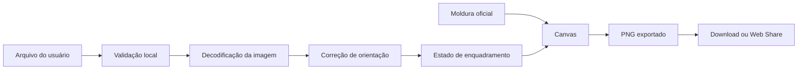

# Gerador de imagens

## Objetivo

Transformar uma foto enviada pelo apoiador em três peças oficiais, preservando privacidade e oferecendo controle suficiente de enquadramento em telas pequenas.

## Formatos

| Formato | Dimensão | Uso principal |
| --- | ---: | --- |
| Avatar | 1080 × 1080 px | Perfil de WhatsApp, Instagram e Facebook |
| Post | 1080 × 1350 px | Feed do Instagram em proporção 4:5 |
| Story | 1080 × 1920 px | Story do Instagram e status do WhatsApp |

Se a equipe optar por 1080 × 1440 px para o post, a decisão deve ser registrada e aplicada às molduras e aos testes. O padrão recomendado é 4:5 por ocupar melhor o feed sem sair do formato amplamente aceito.

## Fluxo do usuário

1. Ler o aviso curto de privacidade.
2. Escolher ou fotografar uma imagem.
3. Validar o arquivo localmente.
4. Selecionar um tema oficial.
5. Arrastar, ampliar e reposicionar a foto.
6. Alternar entre avatar, post e story para revisar recortes.
7. Baixar uma peça ou as três.
8. Compartilhar pelo menu nativo quando disponível.

## Pipeline local

A foto do usuário não deve ser enviada à API. A definição da moldura e seus arquivos públicos podem vir do servidor ou CDN.

## Validação de entrada

- Formatos aceitos: JPEG, PNG e WebP.
- HEIC pode receber mensagem orientando conversão, salvo se houver biblioteca local específica e testada.
- Limite inicial recomendado: 15 MB.
- Resolução mínima recomendada: 720 px no menor lado.
- Rejeitar arquivos que não possam ser decodificados como imagem.
- Revogar URLs temporárias com `URL.revokeObjectURL` após uso.

## Estado do editor

Cada formato mantém:

- `scale`: escala atual.
- `offsetX` e `offsetY`: deslocamento.
- `rotation`: inicialmente fixada após normalização da orientação.
- `templateId`: moldura escolhida.
- `outputWidth` e `outputHeight`.

O enquadramento pode ser compartilhado proporcionalmente entre formatos, mas cada formato deve permitir ajuste próprio para evitar cortes inadequados.

## Composição

A ordem de renderização recomendada é:

1. Fundo definido pela moldura.
2. Foto do apoiador recortada na área permitida.
3. Gradientes ou máscaras intermediárias.
4. Moldura oficial em PNG/WebP transparente.
5. Marca e textos que façam parte da peça oficial.

Molduras precisam ter as mesmas dimensões do formato final e uma área segura documentada. O editor deve impedir que controles cubram a prévia relevante.

## Interação

- Mouse: arrastar e usar roda ou controle de zoom.
- Toque: arrastar com um dedo e ampliar com gesto de pinça.
- Teclado: controles alternativos para zoom e deslocamento.
- Botão **Centralizar novamente** restaura o enquadramento.
- Mudanças aparecem imediatamente na prévia, sem upload.

## Exportação

- Usar `canvas.toBlob` com `image/png`.
- Arquivo: `edson-albertassi-{tema}-{formato}.png`.
- Não confiar apenas em `toDataURL`, que consome mais memória.
- Processar formatos em sequência em aparelhos com pouca memória.
- Liberar canvas, bitmaps e URLs temporárias após exportação.
- Usar Web Share API somente quando houver suporte a compartilhamento de arquivos.

## Falhas e recuperação

- Arquivo muito grande: explicar o limite e pedir outra imagem.
- Imagem pequena: avisar sobre possível perda de qualidade e permitir troca.
- Moldura indisponível: desabilitar somente aquele tema.
- Memória insuficiente: oferecer geração de um formato por vez.
- Compartilhamento indisponível: manter download como alternativa.

## Critérios de aceite

- Nenhuma requisição contém os bytes da foto do apoiador.
- Exportações possuem exatamente as dimensões documentadas.
- A moldura não fica distorcida.
- Gestos funcionam sem rolar a página acidentalmente durante o ajuste.
- Orientação de fotos de celular é respeitada.
- O fluxo funciona nas versões suportadas de Safari iOS, Chrome Android e navegadores desktop.
