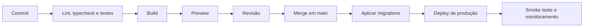

# Deploy e operação

## Ambientes

| Ambiente | Finalidade | Dados |
| --- | --- | --- |
| Local | Desenvolvimento | Banco local e storage de teste |
| Preview | Revisão de pull request | Banco e bucket isolados |
| Produção | Site público | Recursos oficiais com backup |

Preview nunca deve compartilhar banco, bucket ou credenciais com produção.

## Plataforma recomendada

Vercel é a opção natural para Next.js. PostgreSQL pode ser hospedado em serviço compatível com Prisma e o storage pode usar Vercel Blob ou outro serviço S3. A arquitetura não deve depender de APIs proprietárias fora de adaptadores bem definidos.

## Pipeline

## Ordem de produção

1. Confirmar backup recente.
2. Executar migrations compatíveis com a versão anterior quando possível.
3. Publicar a aplicação.
4. Executar smoke tests.
5. Acompanhar erros e métricas.
6. Reverter aplicação ou aplicar correção segura se necessário.

## Variáveis

Cada ambiente possui valores próprios. Alterações de variável devem ser documentadas no pull request e refletidas em `.env.example` sem segredo. Variáveis removidas devem ser apagadas do provedor após o deploy estável.

## Banco

- Executar `prisma migrate deploy` no pipeline controlado.
- Não usar `prisma db push` em produção.
- Backups automáticos precisam de retenção definida.
- Testar restauração periodicamente.
- Pool de conexões deve ser compatível com o ambiente serverless.

## Storage

- Separar buckets por ambiente.
- Configurar CORS apenas para origens necessárias.
- Definir política de retenção para mídias órfãs.
- URLs públicas servem apenas arquivos editoriais aprovados.
- Fotos dos apoiadores não entram no storage.

## Observabilidade

Monitorar:

- Erros de servidor e cliente.
- Latência das rotas públicas.
- Falhas de login e upload sem expor dados sensíveis.
- Core Web Vitals.
- Disponibilidade do banco e storage.
- Falhas de publicação agendada.

Alertas precisam indicar ação e responsável. Analytics de campanha só deve ser ativado após definição de privacidade e consentimento aplicável.

## Smoke tests

- Landing page responde e exibe ação principal.
- Uma notícia publicada abre por slug.
- Admin exige login.
- Login autorizado chega ao dashboard.
- Upload editorial funciona.
- Molduras carregam e uma exportação pode ser gerada.
- `robots.txt` e `sitemap.xml` estão acessíveis.

## Rollback

- Reversão de código não deve pressupor reversão automática de migration.
- Mudanças de banco devem ser compatíveis em duas fases quando houver risco.
- Mídias publicadas permanecem disponíveis durante rollback.
- Incidentes registram linha do tempo, impacto, causa e ação preventiva.

## Domínio e SEO

- Forçar HTTPS.
- Definir domínio canônico único.
- Redirecionar variantes de `www` conforme decisão oficial.
- Gerar sitemap com rotas públicas e notícias publicadas.
- Bloquear admin, prévias e rotas internas em `robots` e metadados.
